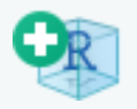
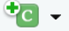

<!-- README.md is generated from README.Rmd. Please edit that file -->

```{r, include = FALSE}
knitr::opts_chunk$set(
  collapse = TRUE,
  comment = "#>"
)
```
# Building R Packages

This is a workshop which has been designed as a guided walk through for how to organise a series of functions into an R package. Building functions is outside of the scope of of this workshop. For a refresher on function construction click [here](https://r4ds.had.co.nz/functions.html).

This workshop comes with a set of existing functions contained in the **MyFunctions.R** file of this GitHub repository. If you would prefer to use some of your own existing functions, you are welcome to do so. The slides that were used as an introduction to this workshop will also be provided in this repository if you would like to view them again.

Much of the process of R package building has been automated by a variety of packages that have all had a significant contribution from Hadley Wickham. Let's start by making sure that these packages have been installed.

```{r, eval = FALSE}
install.packages("roxygen2")
install.packages("devtools")
install.packages("usethis")

library(roxygen2)
library(devtools)
library(usethis)
```

## Initiating a new package

### By using RStudio
The easiest method of initiating a new package is to create an RStudio project. Either click on **File->New Project**, or the  button. A 'Create Project' window will pop up, and you should select **New Directory->R Package**. The following window will then open, allowing you to select a name for your package, as well as choose the directory in which the package will be stored. At this point, you can select if you would like to initiate this repository with Git repository. If you already have Git installed on your computer, I recommend that you check the **Create a git repository** box before you select **Create Project**.

<center></center>

A new RStudio window will open containing your new project. In your project window, you will see that a number of files have been automatically generated. These are the basic file types that are required for an R package.

If you have initiated a Git repository, you should make your first commit. Go to the [**How to use git to track your package over time**](## how-to-use-git-to-track-your-package-over-time) section for instructions on how to do this.

### By hand

Another way to initiate a new R package, is by executing the following line (supplying your own directory and name).

```{r, eval = FALSE}
create_package("~/directorypath/packagename")
```

This should open a new RStudio window, and will build a project within the specified directory, containing all of the base files required to build a package.

If you have Git installed on your computer, you can turn this project into a git repository as well by executing the following line:

```{r, eval = FALSE}
use_git()
```

The function will prompt you to make a first commit. Agree.

### Required files and folders

R packages must be organised with a particular file structure. Some files and folders are more or less necessary, but you can expect to interact with some combination of the following.

**Necessary files and folders**

| File/Folder | Purpose |
|-|---|
| R folder | This folder contains .R scripts. This is where you will store all of your functions. |
| man folder | This folder contains information that will be used to generate help files. The contents of this folder should always be auto generated. You should never modify these files by hand. |
| DESCRIPTION file | This file contains important metadata about your package, including authorship, licencing, and dependencies. | 
| NAMESPACE file | This file states whether each function is exported from this package to be used by others, or imported from another package to be used locally.|

**Useful files and folders**

| File/Folder | Purpose |
|-|---|
| .Rroj file | This is a file generated by RStudio which contains project option information. |
| .Rbuildignore file | This is a text file that can be used to specify any files that you want to ignore when building your R package. | 
| .gitignore file | This is a useful file if you are tracking your R package with Git. It allows you to prevent particular files from being tracked. |
| Data folder | This folder is where you will place any data that your package needs access to to function. This data can also be made directly available to users. |
| data_raw folder | This folder contains scripts that can be used to generate the data contained in the Data file. | 
| vignettes folder | This folder can hold any vignettes that you build to help others learn how to use your package. |

### Add a license to your package

A DESCRIPTION file will have automatically generated for you when you generated your project. Now you must fill in this file in order to generate appropriate metadata for the package. The first thing we should do is specify the license, because it's annoying and we do not want to think about it ever again. 

> **_Note:_** To be clear, you do not need to specify a license for your package to function. If you never intend to share your package with the outside world, feel free to omit a license.

For a simple guide to help choose the right license for you, click [here](https://choosealicense.com/). For a more in depth discussion on licensing, click [here](https://thinkr-open.github.io/licensing-r/whatis.html).

For most of you, I recommend going with the GPL version 3 license. It allows people to use your code freely, but requires users to cite where they sourced the code from. This license will also require users to document how they have changed the code if they choose to share modifications. If your package is built by a community or is owned by an organisation, you will need to take more care to choose the correct licence for your situation.

To easily add the recommended license you your package, run the following code:
```{r, eval = FALSE}
use_gpl_license()
```

This will update the DESCRIPTION file license, as well as generate LICENSE files in your package directory. You can now go ahead and provide the rest of the required information in the DESCRIPTION file.

### Filling in the DESCRIPTION file
Filling the DESCRIPTION file will require some degree of manual addition. You will need to provide the Title, Author (yourself), Maintainer (yourself), and provide a Description. If you open the DESCRIPTION file you will see prompts for all of these fields. Do not touch the other automatically generated fields.

In the case that more than one person is contributing to your package, you can click [here](https://r-pkgs.org/metadata.html#description-authors) to find out how to properly credit people.

In addition to the fields that are already in your file, there is additional information that you can provide, the most important of which include the Depends and Imports fields. These fields can be filled/created using a variety of functions that I will not discuss in detail here. These functions, including `document()`, `use_package("package")`, and `use_github()` will be discussed later on in the workshop. As your package develops, you should keep the DESCRIPTION file up to date. 

### Add code to your package
Now is a good time to start adding functions to the package. Copy and paste the functions from the **MyFunctions.R** file in this repository into the automatically generated hello.R file in your R folder. You can delete the content of this file.

Take a look at the contents of this file and note the different kinds of information contained in there.

In addition to organising the contents of this file, you will also be documenting them using a special format that will allow you to build help files (users will be able to call `?function` or `help(function)` to find information about a function). Much of the work for building help files has been made easier with the `roxygen2` and `devtools` packages. 

#### Package data

The first thing that you will notice is that the file contains a number of data objects that are used to generate the output of one of the functions. This information should not be contained in the R folder as they are not themselves functions. To accommodate the data, you will need to generate two new folders. A data folder which will contain the built data objects, as well as a data_raw file which will contain scripts to generate the data contained in the data folder.

Run the following line to generate the data_raw folder and initiate a file for defining the `magicAnswers` object. 

```{r, eval = FALSE}
use_data_raw("magicAnswers")
```

Copy the code to generate the magicAnswers data.frame into the magicAnswers.R file which was automatically opened within your RStudio project. Make sure not to delete the `use_data(magicAnswers, overwrite = TRUE)` line when you do so. Run the magicAnswers.R script to generate the data folder as well as the magicAnswers.rda file within said folder.

You can now reuse the above code, replacing "magicAnswers", with "cookieAnswers", and then "tarotAnswers". Make sure to again copy the code used to generate these two data.frames into their respective data_raw files. Once you run these two scripts, their respective .rda files will be added to the data folder.

You can now delete the code for defining these three objects from the hello.R file.

> **_NOTE:_**  The method that we have used to create data objects for your R package, will make it so that the data will be made available to whoever uses your package. As a result you will need to provide documentation for the data objects. 
>
> It is absolutely possible to create internal data which will not be made available you your users. In this instance you will need to add an additional argument to the `use_data` function. Expressly `internal = TRUE`. This will create a sysdata.rda file in your R folder (the proper format for internal data). 
>
>The issue with simply adding the `internal = TRUE` argument to each instance of the `use_data` function in the example we have discussed, is that you will overwrite the sysdata.rda each time you use the function. Therefore, if you have multiple data objects that you want to make internal, you should combine all the relevant files in the data_raw folder into a single file, that only calls the `use_data` function once at the end. Following the example that we have been using in this workshop, the function would take the form:
>
>```use_data(magicAnswers, cookieAnswers, tarotAnswers, overwrite = TRUE, internal = TRUE)
>
> This will create a sysdata.rda file containing three objects. For the purpose of this work shop, we will keep the data external to practice documenting data. 
```

Now what you need to do is add some documentation for the data. This documentation will be used to generate help files that will explain the contents of the data, the form that it takes, and what it can be used for.

The first thing to do is to generate a script that you will call data.R, and save in the R folder. This script will contain no data, only documentation. For each data object that you make available to your users, you will need to create an entry of the following format:

```{r, eval = FALSE}
#' Name of your object.
#'
#' A description of what the object is.
#'
#' @format A description of the format that your object will take
"objectName"
```

Note that each line of the documentation is begins with `#'`. For a example of this in action, click [here](https://github.com/hadley/babynames/blob/master/R/data.R) to see the data documentation for the babynames data package built by Hadley Wickham. I will also give some examples of how to improve your description of the format of your object.

#### Documenting functions

Now you can start to organise the functions themselves in a useful way. Some people keep all their functions in a single file, others create a new file for each function in their package. Personally, I like to have a few files, each with their own theme. I will then organise the functions into each of these files according to what I think are useful groupings.

Open how ever many scripts as you think is useful, and add the relevant functions to each script. Give each script a relevant name, and save it in the R folder of your package. Once you have finished this, you should no longer have a file called hello.R.

The next step is to document your functions appropriately. This documentation will be used to generate the help files for the functions in your package. A good thing about the syntax for documentation specified by the `roxygen2` and `devtools` packages is that the documentation will always be placed above the function itself. This will help you to remember to update the documentation if you ever update the function.

The syntax is similar to that used for documenting data.

```{r, eval = FALSE}
#' Short title for the purpose of the function
#' 
#' A description of the behaviour of the function.
#' @param x Description of the x parameter, including the expected format.
#' @param y Description of the x parameter, including the expected format.
#' @export
#' @examples
#' someFunc(1, 1)
someFunc <- function(x, y) {
  ...
}
```

Again, note that each line of the documentation is begins with `#'`. This is required for the `roxygen2` function to recognise that this information should be treated as documentation.

The most important things to include are the title, the parameters, and to specify if the function will be exported. If you do not include `#' @export`, the function will not be available to users. You may choose to make a function internal (not available to users) in the case that it is called from within another function, and is only intended to support that function.

You can quickly generate skeleton documentation by placing your cursor somewhere within a function, and then clicking on **Code->Insert roxygen skeleton**. You can then fill out the skeleton to have meaningful information.

**Tags that you can use to document your functions are listed bellow:**

| Input | Purpose |
|-|---|
| `@description` | This input is only required if the description that you are giving you function is multiple paragraphs long. | 
| `@param` | This input should be used for every parameter that is listed by your function. Should appear in the format `@param paramName Description of parameter and the format that parameter values should take.` |
| `@details` | Can be used if you would like to give some in depth description about the behavior of your function. |
| `@returns` | To give details about the format of the output of your function. |
| `@export` | Stated if the function is to be made available to users. No additional text should be provided. | 
| `@example` | Used to give a self contained example of how the function can be used. |
| `@importFrom` | Used to specify if there are any functions used internally by your function that originate from another package. Should appear in the format `@importFrom packageName functionName`. |

Importing functions that your function requires is useful as it makes sure that those functions have been exported by your package without having to load the entire supporting package into the environment.

#### Generating NAMESPACE and help files

Once you have finished documenting your data and functions, it is time to generate the content of the NAMESPACE file, and generate files for the man folder (the basis for your help files).

To do this, all you need is to run the following line:
```{r, eval = FALSE}
document()
```

You may receive a warning message stating `Skipping NAMESPACE, It already exists and was not generated by roxygen2`. If this is the case, just delete your NAMESPACE file and rerun `document()`. It will rebuild the NAMESPACE file in the correct format.

Check the NAMESPACE file. It should contain a list of all the functions in your package. If it is missing something, check that you have documented your functions correctly (specifically, that you included `#' @export` in your documentation). 

Check the contents of your man folder. It should be filled with .Rd files for each of your functions. You should never edit these files by hand.

You can now inspect the help files that you have generated using the standard forms: ```?tellMyFortune```, or ```help(tellMyFortune)```.

## Installing your package

In top right pane of your RStudio window, click **Build->Install**. Alternatively, you can run the command `install()` in your console. You now have built and installed your own package!

If you are already tracking your package with Git, now would be a good time to make a commit.

## Checking your package

There are a number of checks that can be run to make sure that your R package has been built correctly. As is the case with other aspects of building packages, many of these checks can be done automatically. 

There are two ways that you can run these automatic checks. The first is to click **Build->Check**. The second is to run `check()` in your console. 

In either case, you will see a large text output showing the outcome of these various checks. At the end of this output you will see a summary of the conclusions of the check, which will look something like this:

<center></center>
 
If issues with the package are flagged, you can now scroll through the output for a better description of exactly what is causing errors. As this functionality has been designed expressly to help users improve their packages, the error messages are usually extremely helpful, and often prompt you on how to fix the issue. Errors need to be fixed for proper package functioning. You should resolve as many warnings and notes as is feasible.

## Vignettes

Often packages can come with a number of vignettes that assist the user to become acquainted with the full functionality of the package. For a package published on GitHub, the bare minimum in this regard is to create a README with instructions on how to install the package. Ideally you will also provide some examples of the functions available and how to use them.

To initiate a README:
```{r, eval=FALSE}
use_readme_rmd()
```

This will build a README.Rmd file and open it. The file will contain a lot of prompts for things that you can include. Now you just need add some information to the file. You can delete sections that you are not interested in.

If you want to see a preview of what the README will look like, click the  button at the top of the main pane of RStudio. Alternatively, you can run `build_readme()`. When you push your package to GitHub, your README will be visible in your GitHub package page.

To give instructions on how to install the package, add an R code chunk to your README. You can do this by clicking the {width=45} button and then selecting **R**. Add the argument `eval=FALSE` to the code chunk to prevent the code from being evaluated. Within the code chunk you can give provide the code that will be used to install the package. The code chunk should look something like this:

{width=40%}

If you want to demonstrate how to use a function and display the output of that function, then don't include `eval=FALSE` argument.

If you would like to create additional vignettes on top of the README you can run the following:

```{r, eval=FALSE}
use_vignette("vignetteName")
```

This will generate a vignettes folder, and a template vignette for you to fill.

Before you push a vignette to your GitHub, you must first  the the file the generate the html document that will be read.


# How to use git to track your package over time

As stated previously, a Git repository can easily be initiated by running `use_git()`, including performing your first commit. You can also specify that you want to initiate your RStudio project with a Git repository. If you do it this way however, you will need to create your first commit yourself.

There are number of ways of interacting with Git (terminal, GitHub Desktop, RStudio...). I will keep it simple for this workshop, and show you how you can keep track of your package just by using RStudio functionality. In the top right pane, you should see a Git tab, if you click on it you will be given a number of tools that will allow you to interact with Git. Along the top of this tab are a number of buttons that can replace the most common Git terminal commands. This tab will also list any files that do not match the previous commit. This could be because the file was modified, or because the file has been created since the last commit. These types of files will appear as shown below. 

<center></center>

Newly added files will have a yellow question mark under the Status column, while a modified file will have a blue M listed to the right hand side of the column. It can be seen that under the Staged column, neither of the boxes have been ticked off. This means that neither of these files have been staged to be committed. In order to stage files, the user simply needs to tick the boxed listed in the staged column. As shown below.

<center></center>

Once these files have been staged, their status will change. New files will be indicated with a green A, while the blue M for modified files will now be listed to the left. To commit the selected files, the user needs to select the **Commit** button. This will open up a window that will give the opportunity to provide a commit message. Provide a meaningful description of the changes that you have made, then select **Commit**.

If you would like to see the differences in the listed files when compared to the most recent commit, you can select the **Diff** button. This will open up a window which will allow the user to explore the differences for each affected file. It is possible to stage files and commit them within this window.

In the top pane of the Git tab, it is possible to pull from the remote repository (blue down button), and push to the remote repository (green up button). You can view the previous commit messages by clicking the clock. The blue gear button provides functionality to **Revert...** to previous commits, as well as to modify the **Ignore...** file. The button with purple shapes allows the user to create new branches, as well as add new remote repositories. Finally, you can see the name of the branch currently occupied. In the case of the provided example, this is the 'master' branch. If you click on the branch name, you will be able to switch between the branches that you have created.

### Open Terminal in RStudio

Terminal can be opened from within the RStudio IDE. It is opened in a new tab in the Console pane. If it is not already open you can open a new Terminal shell with the following keyboard short-cut: **Shift+Alt+T**. You can also open this window by clicking on **Tools->Terminal->New Terminal**. Once you have a Terminal shell open, you can use it as a regular Terminal window to initiate Git and track changes in your project. If you want to learn how to use Git through the command line, you can use the [Pro Git](https://git-scm.com/book/en/v2) handbook.

## Publishing your package on GitHub

If you want to share your package with other people, you will need to create a remote repository for your project on a host like GitHub. First you will need to create an account if you do not already have one. Click [here](https://docs.github.com/en/get-started/onboarding/getting-started-with-your-github-account) for instructions on how to do so.

Once you have an account, on the repositories tab of your profile you can select to initiate a new repository. You will be required to name your project, and select if the repository is to be public or private. You can choose if you want to provide a description of your project, or if you want to automatically generate helper files like a README, .gitignore, or a license. If you are creating this remote repository for an already existing local repository you should NOT initiate a README, .gitignore, or choose a license. If you choose to initiate these files you will need to resolve merge conflicts when you try to push your local project to the remote repository.

Once you select **Create repository**, you will be taken to a page with instructions on how set up the repository depending on your particular situation. The commands are provided for you including the correct Git addresses, so you can copy the relevant commands directly into terminal, making sure that you are within the correct local directory. If you use the terminal window within RStudio, you should automatically be in the correct directory.

For example, if you want to push a local repository on to your new remote, you can follow the instructions under the heading "…or push an existing repository from the command line", as bellow:
```
git remote add origin https://github.com/JohnDoe/test.git
git push -u origin main
```

From this point on, you can work directly with the Git tab on RStudio. Whenever you have an update to the package, commit the change and push the new version to your GitHub repository.

### Automatically generating a remote repository

If Git on your computer has already been set up to interact with your GitHub account, you will be able to automatically generate a remote repository, and push your package to that remote using the `usethis` package.

Simply run:
```{r, eval=FALSE}
use_github()
```

The following checks will be performed: 

- that the project is already a Git repo
- that the current branch is the default branch
- that there are no uncommitted changes
- that there are no pre-existing origin remotes

If these checks pass, the following actions will be performed:

- An associated repository will be created on your GitHub
- That GitHub repository will be added to your local repository as the origin remote
- Make an initial push to GitHub
- Calls `use_github_links()` if the project is an R package, so as to add information to the DESCRIPTION file regarding the GitHub repository

## Additional resources

**Keyboard shortcuts**

Install Package:  'Cmd + Shift + B'

Check Package:    'Cmd + Shift + E'

**List of functions**

| Function | Purpose |
|-|---|
| `create_package()` | Generates a new RStudio package project. |
| `use_git()` | Initiates a Git repository and performs the first commit. |
| `use_gpl_license()` | Generates files and metadata associated with th GPL version 3 license. |
| `use_data_raw()` | Creates a data_raw folder if there isn't one, and generates a script for defining the generation of a data object. |
| `use_data()` | Creates a data folder if ther isn't one, and creates a file for that object. |
| `document()` | Uses function documentation to generate help files. |
| `use_package()` | Adds a package to the Imports field of the DESCRIPTION file. |
| `use_readme_rmd()` | Generates a README.Rmd file. |
| `build_readme()` | Uses the README.Rmd file to build the README.md file. |
| `use_github()` | Generates a remote repository for the local Git repository. |
| `use_github_links()` | Adds metadata to the DESCRIPTION file. | 


**Useful resources**

[Building functions](https://r4ds.had.co.nz/functions.html)

[Licensing your package](https://thinkr-open.github.io/licensing-r/whatis.html)

[**THE** R package guide](http://r-pkgs.had.co.nz/)

[Installing Git](http://git-scm.com/downloads)

[A guide for Git use with R](https://happygitwithr.com/)

[Setting up your own GitHub account](https://docs.github.com/en/get-started/onboarding/getting-started-with-your-github-account)

[Formally testing your package](https://r-pkgs.org/testing-basics.html): This is something that we have not discussed in this workshop.

[A package for generating package icons](https://github.com/mitchelloharawild/icons)
