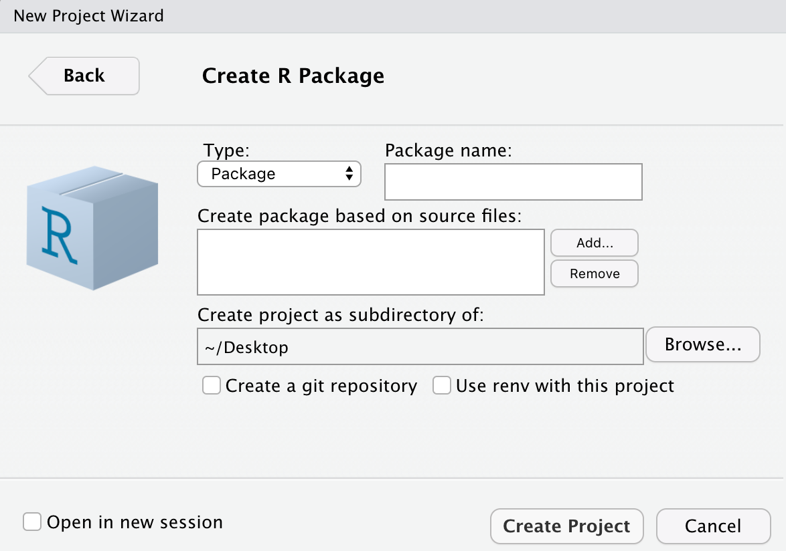

<!-- README.md is generated from README.Rmd. Please edit that file -->

```{r, include = FALSE}
knitr::opts_chunk$set(
  collapse = TRUE,
  comment = "#>"
)
```
# Building R Packages

This is a workshop which has been designed as a guided walkthrough for how to organise a series of functions into an R package. The building of functions themselves is outside of the scope of of this workshop. For a refresher on function construction you can visit the following: https://r4ds.had.co.nz/functions.html.

This workshop is meant as a guide to assist in the conversion of the functions contained in the MyFunctions.R file of this GitHub repository, into an R package.

```{r, eval = FALSE}
install.packages("usethis")
install.packages("roxygen2")
install.packages("devtools")
```

## Initiating a new package
The easiest method of initiating a new package is to create an RStudio project. Either click on 'File' and then 'New Project', or {width=3%} in the top left corner of the RStudio window. A 'Create Project' window will pop up, and you should select 'New Directory' followed by 'R Package'. The following window will then open, allowing you to specify the name for your package as well as choose the directory in which the package will be stored. At this point, you can select if you would like to initiate this repository with git repository. If you already have git installed on your computer, I recommend that you check the 'Create a git repository' box before you select 'Create Project'.

<center>{width=50%}</center>

In your project window, you will see that a number of files have been automatically generated. These are the basic file types that are required for an R package.

**By hand**

Another way to initiate a new R package, is by executing the following line:

```{r, eval = FALSE}
create_package("~/directorypath/packagename")
```

This should open a new RStudio window, and will build a project within the specified directory, containing all of the base files required to build a package.

You can turn this protopackage into a git repository as well, by executing the following line:

```{r, eval = FALSE}
use_git()
```

The function will prompt you to make a first commit. Agree.

**Required files and folders**

| File/Folder | Purpose |
|-|---|
| R folder | This folder contains .R scripts. This is where you will store all of your functions. |
| man folder | This folder contains information that will be used to generate help files. The contents of this folder should always be auto generated. You should never modify these files by hand. |
| DESCRIPTION file | This file contains important metadata about your package, including authorship, licencing, and dependencies. | 
| NAMESPACE file | This file states whether each function is exported from this package to be used by others, or imported from another package to be used locally.|

**Useful files and folders**

| File/Folder | Purpose |
|-|---|
| .Rroj file | This is a file generated by RStudio which contains project option information. |
| .Rbuildignore file | This is a text file that can be used to specify any files that you want to ignore when building your R package. | 
| .gitignore file | This is a useful file if you are tracking your R package with git. It allows you to prefent particular files from being tracked. |

**Additional files and folders**

| File/Folder | Purpose |
|-|---|
| Data folder | This folder is where you will place any data that your package needs access to to function. This data can also be made directly available to users. |
| data_raw folder | This folder contains scripts that can be used to generate the data contained in the Data file. | 
| vignettes folder | This folder can hold any vignettes that you build to help others learn how to use your package. |

### Fill in the DESCRIPTION file

A DESCRIPTION file will have automatically generated for you, but you will still need to provide some information. The first thing we should do is specify the license, because it's annoying and we do not want to think about it ever again. To be clear, you do not need to specify a license for your package to work, so if you never intend to share your package with the outside world, feel free to omit a license.

For most of you, I recommend going with the GPL version 3 license. It allows people to use your code freely, but requires users to cite where they sourced the code from. This license will also require users to document how they have changed the code if they choose the share modifications.

For a simple guide to help choose the right license of you, click [here](https://choosealicense.com/). For a more in depth discussion on licensing, click [here](https://thinkr-open.github.io/licensing-r/whatis.html).

To easily add the recommended license you your package, run the following code:
```{r, eval = FALSE}
usethis::use_gpl_license()
```

This will update the DESCRIPTION file license, as well as generate LICENSE files in your package directory. You can now go ahead and provide the rest of the required information in the DESCRIPTION file.

### Add code to your package
Now it would be a good time to start adding functions to the package. Copy and paste the functions from the MyFunctions.R file in this repository into the auto generated hello.R file in your R/ folder.

This is probably a good place to make your first commit if you have initiated your project with a git repository (do not worry about this if you have not). Click here.... for instruction on this front.

Take a look at the contents of this file and note the different kinds of information contained in there.

In addition to organising the code of our package, we will also be documenting using a special format that will allow us to build help files (users will be able to call `?function` or `help(function)` to find information). Much of the work for building help files has been made easier with the `roxygen2` and `devtools` packages. So lets get started by installing and loading those packages.

```{r, eval = FALSE}
library(roxygen2)
library(devtools)
```

#### Package data

The first thing that you will see is that this file contains a number of data.frames that are used to generate the output of one of the functions. This information should not be contained in the R folder as they are not themselves functions. Here we will need to generate two new folders. A data folder which will contain the built data objects, as well as a data_raw file which will contain scripts to generate the data contained in the data folder.

Run the following line to generate the data_raw folder and initiate a file for defining the `magicAnswers` object. 

```{r, eval = FALSE}
usethis::use_data_raw("magicAnswers")
```

Copy the code to generate the magicAnswers data.frame into the magicAnswers.R file which was opened within your RStudio. Make sure to not delete the `usethis::use_data(magicAnswers, overwrite = TRUE)` line when you do so. Run the magicAnswers.R script to generate the data folder as well as the magicAnswers.rda file within said folder.

You can now reuse the above code, replacing "magicAnswers", with "cookieAnswers", and then "tarotAnswers". Make sure to again copy the code used to generate these two data.frames into their respective data_raw files. Once you run these two scripts, their respective .rda files will be added to the data folder.

You can now delete the code for defining these three objects from the hello.R file.

> **_NOTE:_**  The method that we have used to create data objects for your R package, will make it so that the data will be made available to whoever uses your package. As a result you will need to provide documentation for the data objects. 
>
> It is absolutely possible to create internal data which will not be made available you your users. In this instance you will need to add an additional argument to the `use_data` function. Expressly `internal = TRUE`. This will create a sysdata.rda file in your R folder (the proper format for internal data). 
>
>The issue with simply adding the `internal = TRUE` argument to each instance of the `use_data` function in the example we have discussed is that you will overwrite the sysdata.rda each time you use the function. Therefore, if you have multiple data objects that you want to make internal, you should combine all the relevant files in the data_raw folder into a single file, that only calls the `use_data` function once at the end. Following the example that we have been using in this workshop, the function would take the form:
>
>```usethis::use_data(magicAnswers, cookieAnswers, tarotAnswers, overwrite = TRUE, internal = TRUE)```

Now what we need to do is add some documentation for the data. This documentation will be used to generate help files that will explain the contents of the data, the form that it takes, and what it can be used for.

The first thing to do is to generate a script that you will call data.R, and save in the R folder. This script will contain no data, only documentation. For each data object that you will make available to your users you will need to create an entry of the following format:

```{r, eval = FALSE}
#' Name of your object.
#'
#' A description of what the object is.
#'
#' @format A description of the format that your object will take
"objectName"
```

For a example of this in action, click [here](https://github.com/hadley/babynames/blob/master/R/data.R) to see the data documentation for the babynames data package built by Hadley Wickham. I will also give some examples of how to improve your description of the format of your object.

#### Documenting functions

Now we can start to organise the functions in a useful way. There is no set way to do this, so you should pick something that is going to be most useful for you. Some people keep all their functions in the same file, others create a new file for each function in their package. Personally, I like to have a few files, each with their own theme. I will then organise the functions into each of these files according to what I think are useful groupings.

Open how ever many scripts as you like and add the relevant functions to each script. Give each script a relevant name, and save in the R folder of your package. 

The next step is to document your functions appropriately. This documentation will be used to generate the help files for the functions in your package. A good thing about the syntax for documentation specified by the `roxygen2` and `devtools` packages is that the documentation for the function will always be placed above the function itself. This will help you to remember to update the documentation if you ever update the function.

The syntax is similar to that used for documenting data.

```{r, eval = FALSE}
#' Short title for the purpose of the function
#' 
#' A description of the behaviour of the function.
#' @param x Description of the x parameter, inlcuding format.
#' @param y Description of the x parameter, inlcuding format.
#' @export
#' @examples
#' someFunc(1, 1)
someFunc <- function(x, y) {
  ...
}
```

The most important things to include in your package documentation is the title, the parameters, and to specify if the function will be exported. If you do not include `@export` in the description, the function will not be available to users. You may choose to make a function internal (not available to users) in the case that it is called from within another function, and is only intended to support another function that is exported.

You can quickly generate skeleton documentation by placing your cursor somewhere within your function, and then clicking on 'Code', then 'Insert roxygen skeleton'. You can then fill out this description to have meaningful information.

** Tags that you can use to document your functions are listed bellow:**

| Input | Purpose |
|-|---|
| `@description` | This input is only required if the description that you are giving you function is multiple paragraphs long. | 
| `@param` | This input should be used for every parameter that is listed by your function. Should appear in the format `@param paramName Description of parameter and the format that parameter values should take.` |
| `@details` | Can be used if you would like to give some in depth description about the behavior of your function. |
| `@returns` | To give details about the format of the output of your function. |
| `@export` | Stated if the function is to be made available to users. No text should be provided. | 
| `@example` | Used to give a self contained example of how the function can be used. |
| `@importFrom` | Used to specify if there are any functions used internally by your function that originate from another package. should appear in the format `@importFrom packageName functionName`. |

Importing functions that your function requires is useful as it makes sure that those functions have been exported by your package without having to load the entire supporting package into the environment.

#### Generating NAMESPACE and help files

Once you have finished documenting your data and functions, it is time to generate the content of the NAMESPACE file, and generate files for the man folder that are the basis for your help files.

To do this all you need is to run the following line:
```{r, eval = FALSE}
document()
```

You may receive a warning message stating `Skipping NAMESPACE, It already exists and was not generated by roxygen2`. If this is the case, just delete your NAMESPACE file and rerun `document()`.

Check the NAMESPACE file. It should contain a list of all the functions in your package. If it is missing something check that you have docuemted your functions correctly (specifically, that you included `#' @export` in your documentation). 

Check the contents of your man folder. It should be filled with .Rd files for each of your functions.

You can now inspect the help files that your have generated using the standard forms: ```?tellMyFortune```, or ```help(tellMyFortune)```.

Click the 'Build' tab in top right corner of your RStudio window, followed by install. You now have built and installed your own package!

If you are already tracking your package with Git, not would be a good time to make a commit.

## Checking package

There are a number of checks that can be run to make sure that your R package has been built correctly. As is the case with many of the other aspects of building packages, many of these checks can be done automatically. 

There are two ways that you can run these automatic checks. The first is to click the 'Build' tab in the top right hand corner of your RStudio window, then click the 'Check' button. The second is to run `check()` in your console. 

In either case, you will see a large text output showing the outcome of these various checks. At the end of this output you will see a summary of the conclusions of the check that will look something like this:

{width=30%}
 
 You can now scroll through the output for a better description of exactly what is causing these errors. As this functionality has been designed expressly to help users improve their packages, the error messages are usually extremely helpful and often prompt you on how to fix the issue.

## Testing package

## Vignettes

Often packages can come with a number of vignettes that assist the user to become acquainted with the full functionality of the package.

## How to use git to track your package over time

### Publishing your package on GitHub


### S3 functions

### Examples


## Useful shortcuts

Install Package:           'Cmd + Shift + B'
Check Package:             'Cmd + Shift + E'
Test Package:              'Cmd + Shift + T'

## Useful resources

Licensing

For the absolute minimum required for a functioning R package, you can check out this blog by [Hilary Parker](https://hilaryparker.com/2014/04/29/writing-an-r-package-from-scratch/). This blog also shows you how to set up an R package manually.

Main: http://r-pkgs.had.co.nz/
Style guide
