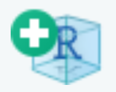
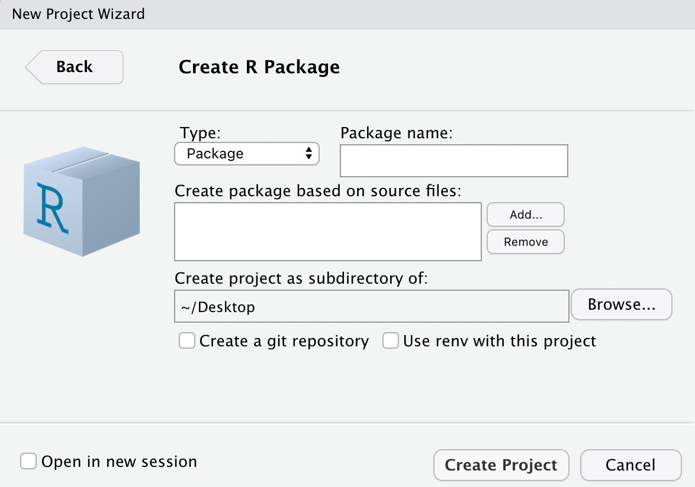

# Building R Packages

This is a workshop which has been designed as a guided walkthrough for how to organise a series of functions into an R package. The building of functions themselves is outside of the scope of of this workshop. For a refresher on function construction you can visit the following: https://r4ds.had.co.nz/functions.html.

## Initiating a new package
### RStudio
The easiest method of initiating a new package is to create an RStudio project. Either click on 'File' and then 'New Project', or {width=3%} in the top left corner of the RStudio window. A 'Create Project' window will pop up, and you should select 'New Directory' followed by 'R Package'.

{width=50%}

### By hand

### DESCRIPTION file

## Organising functions into files
### Functions
### Data

## Documenting functions

### Importing functions

### S3 functions

### Examples

### Generating NAMESPACE and help files

## Checking package

## Vignettes

## How to use git to track your package over time

### Publishing your package on GitHub

## Useful Resources
